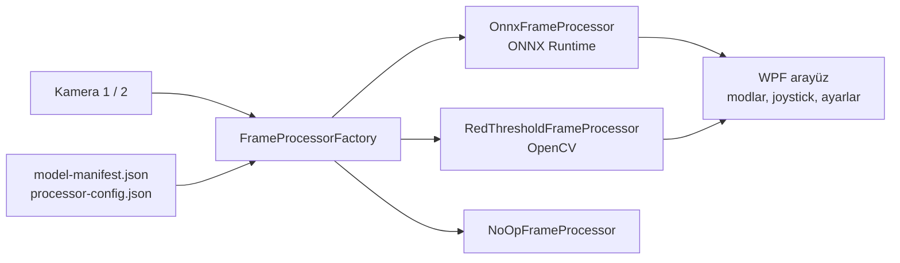

# KORGAN

**Hedef tespit ve takip sistemi için masaüstü kontrol arayüzü.** Kamera görüntüsünü gerçek zamanlı işler, hedefleri renklerine göre (kırmızı / mavi) ayırır ve sistemi farklı otonomi seviyelerinde yönetir.

## Özellikler

- **Çalışma modları:** Manuel, Yarı Otonom, Tam Otonom, Ayarlanabilir
- **İki kamera** görüntüsü ve kameralar arası geçiş
- **Gerçek zamanlı görüntü işleme:** ONNX modeliyle nesne tespiti; model olmadan da çalışan renk eşiği tabanlı yedek işlemci
- **Değiştirilebilir model:** model, etiketler ve işleme ayarları manifest dosyalarından okunur; kod değişmeden yeni model takılabilir
- **Joystick ile kontrol** ve ayar pencereleri
- Güvenlik kilitleri: sistemi devre dışı bırakma, pasif/aktif durum kontrolü

## Mimari

Görüntü işleme ortak bir `IFrameProcessor` arayüzünün arkasında. Hangi işlemcinin kullanılacağı yapılandırmayla seçiliyor, böylece model değişse de arayüz kodu etkilenmiyor.

## Teknolojiler

C# · WPF · .NET 8 · ONNX Runtime · OpenCvSharp (OpenCV) · C++ / CMake (ayrı kamera modülü)

<!-- Ekran görüntüleri: screenshots/ klasörüne ekleyip aşağıdaki satırları açın

-->
